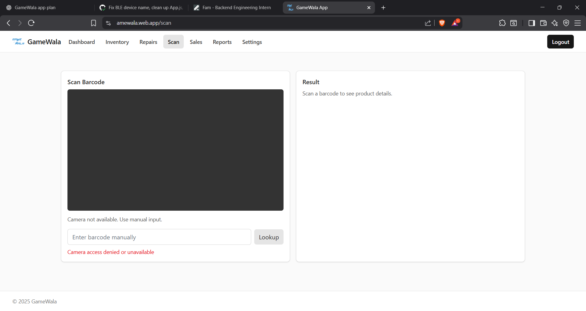

# GameWala

GameWala is a modern web application built with React, TypeScript, and Vite, designed to manage game-related activities. It features a dynamic dashboard, drag-and-drop functionality, and QR code integration.

## 🚀 Live Demo

Check out the live application here: [GameWala Web App](https://amewala.web.app/)

## 📸 Screenshots

<div style="display: grid; grid-template-columns: repeat(auto-fit, minmax(300px, 1fr)); gap: 10px;">
  
  
  
  
  
  
  
</div>

## ✨ Features

- **Dashboard Analytics**: Visualized data using Recharts.
- **Drag & Drop Interface**: Smooth interactions powered by `@hello-pangea/dnd`.
- **QR Code Support**: Generate and scan QR codes with `html5-qrcode` and `jsbarcode`.
- **Authentication**: Secure login and data management via Firebase.
- **Responsive Design**: Styled with TailwindCSS for a seamless experience across devices.

## 🛠️ Tech Stack

- **Frontend**: React 19, TypeScript, Vite
- **Styling**: TailwindCSS, PostCSS
- **State/Logic**: React Router DOM, React Hooks
- **Backend/BaaS**: Firebase
- **Utilities**: ESLint, Prettier

## 📦 Installation

1. **Clone the repository**
   ```bash
   git clone https://github.com/MAYANK2264/GameWala.git
   cd GameWala
   ```

2. **Install dependencies**
   ```bash
   npm install
   ```

3. **Start the development server**
   ```bash
   npm run dev
   ```

4. **Build for production**
   ```bash
   npm run build
   ```

## 📄 License

This project is licensed under the MIT License.
